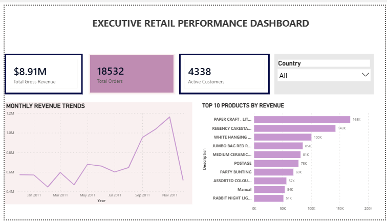

# E-Commerce Executive Sales Performance Analytics

## Project Overview
This project delivers an end-to-end data analytics solution for an international online retailer. By migrating raw, unstructured transaction logs into a relational database management system (RDBMS) and designing an interactive business intelligence dashboard, this project tracks high-level sales trends and isolates top revenue-driving products to optimize inventory allocation.

## Technical Architecture & Tools
* **Database Management & ETL:** Microsoft SQL Server (SSMS)
* **Business Intelligence & Visualization:** Power BI Desktop
* **Data Sources:** Real-world anonymized e-commerce transaction dataset (500k+ records)

## Repository Structure
* `1_Data_Cleaning.sql`: SQL scripts executing data scrubbing, removing missing customer profiles, and filtering out invalid/canceled transactions.
* `2_MoM_Revenue.sql`: Advanced SQL using window functions (`LAG`) and Common Table Expressions (CTEs) to measure Month-over-Month growth rates.
* `3_Top_Products.sql`: SQL scripts leveraging `DENSE_RANK()` to categorize inventory based on total profitability.
* `ECommerce_Executive_Dashboard.pbix`: The native Power BI file containing data models and interactive dashboards.

## Executive Dashboard Preview

## Strategic Business Insights & Recommendations
1. **Strong Q4 Seasonality:** Analysis reveals a major revenue spike beginning in September, peaking sharply in November ($1.1M+). *Recommendation: Retail operations must scale up warehouse staffing and logistics capacity starting in late August to handle a 50%+ surge in order volumes.*
2. **High-Concentration Revenue Drivers:** The "Paper Craft Little Birdie" and "Regency Cakestand" alone generate over $300K in revenue. *Recommendation: Establish buffer-stock inventory practices for these top 10 items to prevent stockouts during peak promotional windows.*
3. **Core Volume vs. Value:** While the business processes over 18,500 unique transactions, total gross revenue relies heavily on a select group of repeat, active customer segments (4,338 unique buyers). *Recommendation: Implement an automated customer loyalty tier program focusing marketing spend on preserving this high-value core customer pool.*
